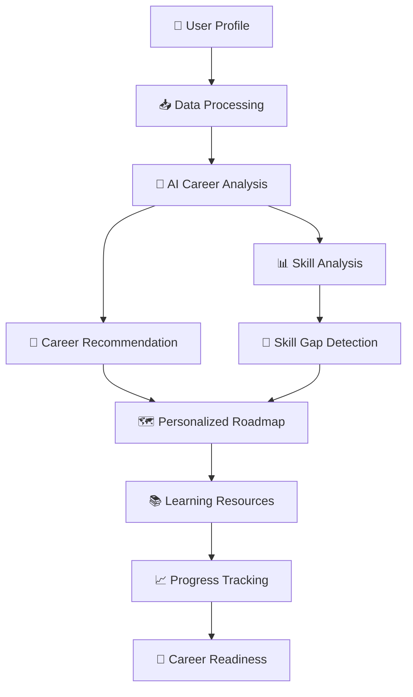

# 🚀 SkillPath AI

### 🤖 AI-Powered Career Recommendation, Skill Gap Analysis & Personalized Learning Roadmap

<p align="center">
  
  
  
  

</p>

<p align="center">
  <b>Turn your current skills into a clear career path.</b>
  <br>
  SkillPath AI analyzes your skills, identifies gaps, recommends suitable careers,
  and generates a personalized learning roadmap.
</p>

---

## 🌟 Overview

**SkillPath AI** is an AI-powered career guidance and skill development platform designed for students, developers, and aspiring software engineers.

Instead of giving generic career advice, SkillPath AI analyzes a user's:

* 🎓 Education
* 💻 Technical Skills
* 📚 Knowledge Level
* 🧑‍💻 Experience
* 🎯 Career Interests
* 🛠️ Projects
* 📈 Current Skill Level
* 🎯 Target Career

It then generates an **AI-powered career analysis**, including:

> **Career Recommendation → Skill Gap Analysis → Learning Roadmap → Resources → Progress**

---

## ✨ Why SkillPath AI?

Many students know they want a career in technology but don't know:

```text
What should I learn?
        ↓
What skills am I missing?
        ↓
Which career is suitable for me?
        ↓
What should I learn first?
        ↓
Which projects should I build?
        ↓
How do I become job-ready?
```

### 💡 SkillPath AI solves this problem.

```text
        👤 USER PROFILE
              │
              ▼
      ┌─────────────────┐
      │   AI ANALYSIS    │
      └────────┬────────┘
               │
       ┌───────┼────────┐
       ▼       ▼        ▼
   🎯 Career  📊 Skill  🧩 Gap
   Match     Analysis   Analysis
       │       │        │
       └───────┼────────┘
               ▼
      🗺️ Personalized
          Roadmap
               │
               ▼
       📚 Learning Resources
               │
               ▼
        🚀 Career Growth
```

---

# 🎯 Core Features

## 🧑‍💻 1. Smart User Profiling

Users can create a profile containing:

* Education
* Degree / Branch
* Programming languages
* Frameworks
* Tools
* Projects
* Experience
* Interests
* Current skill level
* Target career

---

## 🎯 2. AI Career Recommendation

SkillPath AI analyzes the user's profile and recommends suitable career paths.

### Example

```text
User Skills:

Python
SQL
Pandas
NumPy
Statistics
Machine Learning

             ↓

AI Analysis

             ↓

Recommended Careers:

🎯 Data Analyst
🤖 Machine Learning Engineer
📊 Data Scientist
```

---

## 📊 3. Skill Gap Analysis

The platform compares:

```text
Current Skills
      +
Target Career Requirements
      ↓
Skill Gap Detection
```

Example:

| Skill            | Current Level | Required | Gap |
| ---------------- | ------------: | -------: | --: |
| Python           |          8/10 |     8/10 |   ✅ |
| SQL              |          5/10 |     8/10 |  🔴 |
| Statistics       |          7/10 |     8/10 |  🟡 |
| Machine Learning |          4/10 |     8/10 |  🔴 |
| Git              |          5/10 |     7/10 |  🟡 |

---

# 🗺️ 4. Personalized Learning Roadmap

Instead of showing a huge list of technologies, SkillPath AI generates a structured roadmap.

```text
MONTH 1
│
├── Programming Fundamentals
├── Git & GitHub
└── Problem Solving

MONTH 2
│
├── SQL
├── DBMS
└── Backend Fundamentals

MONTH 3
│
├── REST APIs
├── FastAPI
└── Authentication

MONTH 4
│
├── System Design
├── Cloud Basics
└── Deployment

MONTH 5
│
└── Real-World Projects 🚀
```

---

# 📚 5. Learning Resource Recommendation

The system can recommend resources based on the detected skill gaps.

### Resource Types

* 📺 YouTube
* 📖 Documentation
* 🎓 Courses
* 💻 Coding Platforms
* 📚 Books
* 🧪 Projects
* 📝 Practice Problems

---

# 📈 6. Career Readiness Score

SkillPath AI can provide an overall readiness score.

```text
╔══════════════════════════════╗
║      CAREER READINESS        ║
║                              ║
║            72%               ║
║                              ║
║  ███████████████░░░░         ║
║                              ║
║  Keep improving! 🚀          ║
╚══════════════════════════════╝
```

---

# 🎨 UI / UX Design

SkillPath AI is designed as a modern AI-powered SaaS platform.

### Design Principles

* 🌌 Modern AI dashboard
* 🎨 Gradient-based visual design
* 📊 Interactive analytics
* 🧩 Modular cards
* 📱 Responsive interface
* ⚡ Fast navigation
* 🌓 Dark / Light theme
* ✨ Smooth animations
* 📈 Progress visualization

### Main Screens

```text
┌─────────────────────────────────────────────┐
│              SKILLPATH AI                   │
├─────────────────────────────────────────────┤
│                                             │
│  👋 Welcome back, Jeet                      │
│                                             │
│  Career Goal: Software Engineer             │
│                                             │
│  ┌──────────┐ ┌──────────┐ ┌──────────┐    │
│  │ Skills   │ │ Gap      │ │ Readiness│    │
│  │  72%     │ │  28%     │ │  74%     │    │
│  └──────────┘ └──────────┘ └──────────┘    │
│                                             │
│  🎯 Recommended Career                      │
│  Software Engineer                          │
│                                             │
│  🗺️ Your Roadmap                            │
│  ███████████████░░░░ 72%                    │
│                                             │
│  📚 Recommended Resources                   │
│                                             │
└─────────────────────────────────────────────┘
```

---

# 🧠 AI Workflow



---

# 🏗️ System Architecture

```text
                         ┌─────────────────────┐
                         │      USER           │
                         │                     │
                         │ Profile / Skills    │
                         └──────────┬──────────┘
                                    │
                                    ▼
                         ┌─────────────────────┐
                         │     FRONTEND        │
                         │                     │
                         │ HTML / CSS / JS     │
                         └──────────┬──────────┘
                                    │
                              REST API
                                    │
                                    ▼
                         ┌─────────────────────┐
                         │      FASTAPI        │
                         │      BACKEND        │
                         └──────────┬──────────┘
                                    │
                 ┌──────────────────┼──────────────────┐
                 ▼                  ▼                  ▼
          ┌─────────────┐    ┌─────────────┐    ┌─────────────┐
          │   Profile   │    │ AI Analysis │    │   Roadmap   │
          │   Service   │    │   Service   │    │   Service   │
          └─────────────┘    └──────┬──────┘    └─────────────┘
                                    │
                                    ▼
                           ┌─────────────────┐
                           │    GenAI / LLM   │
                           └────────┬────────┘
                                    │
                                    ▼
                           ┌─────────────────┐
                           │ Career Knowledge │
                           │     Base         │
                           └─────────────────┘
```
# 🐳 Docker Architecture

```text
                                       Docker Compose
                     │
          ┌──────────┴──────────┐
          │                     │
          ▼                     ▼
 ┌─────────────────┐   ┌─────────────────┐
 │ Frontend        │   │ Backend         │
 │ Streamlit       │   │ FastAPI         │
 │ Port: 8501      │──▶│ Port: 8000      │
 └─────────────────┘   └─────────────────┘
                              │
                              ▼
                         Mistral AI
```


# 📂 Project Structure

```text
SkillPath-AI/
│
├── 📁 backend/
│   │
│   ├── app.py
│   │
│   ├── 📁 routes/
│   │   ├── profile.py
│   │   ├── career.py
│   │   └── roadmap.py
│   │
│   ├── 📁 services/
│   │   ├── ai_service.py
│   │   └── skill_analyzer.py
│   │
│   ├── requirements.txt
│   └── Dockerfile
│
├── 📁 frontend/
│   │
│   ├── app.py
│   ├── requirements.txt
│   └── Dockerfile
│
├── 📁 data/
│   └── roles.json
│
├── 📁 knowledge_base/
│
├── .env
├── .gitignore
├── .dockerignore
├── docker-compose.yml
├── LICENSE
└── README.md
```

---

# 🛠️ Tech Stack

## Frontend

| Technology   | Purpose               |
| ------------ | --------------------- |
| HTML5        | Structure             |
| CSS3         | UI Design             |
| JavaScript   | Interactivity         |
| Tailwind CSS | Styling               |
| Chart.js     | Analytics             |
| Fetch API    | Backend communication |

## Backend

| Technology | Purpose          |
| ---------- | ---------------- |
| Python     | Backend language |
| FastAPI    | REST API         |
| Pydantic   | Data validation  |
| Uvicorn    | ASGI server      |

## AI / GenAI

| Technology         | Purpose                       |
| ------------------ | ----------------------------- |
| LLM                | Career analysis               |
| Prompt Engineering | Structured AI responses       |
| Embeddings         | Semantic search               |
| Vector Database    | Knowledge retrieval           |
| RAG                | Context-aware recommendations |

## Database

```text
MySQL / PostgreSQL
        │
        ├── Users
        ├── Profiles
        ├── Skills
        ├── Careers
        ├── Skill Gaps
        ├── Roadmaps
        └── Resources
```

---

# 🔌 API Structure

```http
GET     /
GET     /about

POST    /profile
GET     /profile/{user_id}
PUT     /profile/{user_id}

POST    /analysis
GET     /analysis/{user_id}

POST    /roadmap
GET     /roadmap/{user_id}

GET     /resources
GET     /resources/{skill}
```

---

# 🔄 Example User Journey

```text
1️⃣ Create Profile
       ↓
2️⃣ Add Skills
       ↓
3️⃣ Select Career Goal
       ↓
4️⃣ AI Analyzes Profile
       ↓
5️⃣ Career Recommendation
       ↓
6️⃣ Skill Gap Analysis
       ↓
7️⃣ Personalized Roadmap
       ↓
8️⃣ Learning Resources
       ↓
9️⃣ Track Progress
       ↓
🔟 Become Job Ready 🚀
```

---

# 📊 Example AI Output

```json
{
  "recommended_career": "Software Engineer",
  "career_match": 82,
  "current_level": "Intermediate",

  "skill_gaps": [
    "Data Structures & Algorithms",
    "System Design",
    "Backend Development"
  ],

  "roadmap": [
    "Master DSA",
    "Learn REST APIs",
    "Build Backend Projects",
    "Learn System Design",
    "Deploy Production Applications"
  ]
}
```

---

# 🔐 Environment Variables

Create a `.env` file inside the backend directory:

```env
AI_API_KEY=your_api_key
DATABASE_URL=your_database_url
SECRET_KEY=your_secret_key
```

> ⚠️ Never commit your `.env` file to GitHub.

---

# 🚀 Getting Started

### 1. Clone the repository

```bash
git clone https://github.com/jeetgondaliya2-prog/SkillPath-AI.git
```

### 2. Enter the project

```bash
cd SkillPath-AI
```

### 3. Create virtual environment

```bash
python -m venv venv
```

### 4. Activate environment

### Windows

```bash
venv\Scripts\activate
```

### Linux / macOS

```bash
source venv/bin/activate
```

### 5. Install dependencies

```bash
pip install -r backend/requirements.txt
```

### 6. Start FastAPI

```bash
uvicorn backend.app.main:app --reload
```

### 7. Open API documentation

```text
http://127.0.0.1:8000/docs
```

---

# 🧪 Testing

Run tests using:

```bash
pytest
```

---

# 🗺️ Development Roadmap

* [x] Project planning
* [x] Backend architecture
* [x] FastAPI setup
* [ ] User authentication
* [ ] Profile management
* [ ] AI career recommendation
* [ ] Skill gap analysis
* [ ] Personalized roadmap
* [ ] Resource recommendation
* [ ] Progress tracking
* [ ] Interactive dashboard
* [ ] AI chatbot
* [ ] Resume analysis
* [ ] Job recommendation
* [ ] Deployment

---

# 🔮 Future Features

### 🤖 AI Career Mentor

An interactive AI assistant that can answer questions such as:

> "Should I learn React or Angular?"

> "What should I learn after Python?"

> "Am I ready for a Data Analyst internship?"

---

### 📄 AI Resume Analyzer

Upload a resume and receive:

```text
ATS Score
   ↓
Missing Skills
   ↓
Resume Improvements
   ↓
Recommended Projects
   ↓
Target Job Roles
```

---

### 💼 Job Recommendation

Match users with job opportunities based on:

* Skills
* Experience
* Career goals
* Projects
* Location
* Job requirements

---

# 📸 Screenshots

Add your project screenshots here:

```text
docs/
├── landing-page.png
├── dashboard.png
├── career-analysis.png
├── skill-gap.png
└── roadmap.png
```

Example:

```markdown

```

---

# 🤝 Contributing

Contributions are welcome!

```bash
# Fork the repository

# Create a new branch
git checkout -b feature/new-feature

# Make your changes

# Commit
git commit -m "Add new feature"

# Push
git push origin feature/new-feature

# Create Pull Request
```

---

# 📜 License

This project is licensed under the **MIT License**.

See the `LICENSE` file for details.

---

# 👨‍💻 Author

## Jeet Gondaliya

**B.Tech — Electronics & Communication Engineering**
**Indian Institute of Information Technology, Nagpur**

### 🚀 Interests

* 🤖 Generative AI
* 🧠 Machine Learning
* 💻 Software Development
* 📊 Data Analytics
* 🏗️ Backend Development
* 🧩 Data Structures & Algorithms

### 🔗 Connect With Me

<p align="center">

<a href="https://github.com/jeetgondaliya2-prog">

</a>

<a href="https://www.linkedin.com/in/jeet-gondaliya-9428b4381">

</a>

</p>

---

# ⭐ Support

If you find **SkillPath AI** useful, consider giving the repository a ⭐.

It helps support the project and motivates further development.

---

<p align="center">

### 🚀 SkillPath AI

**Learn Smarter. Build Better. Grow Faster.**

Made with ❤️ and 🤖 by **Jeet Gondaliya**

</p>
